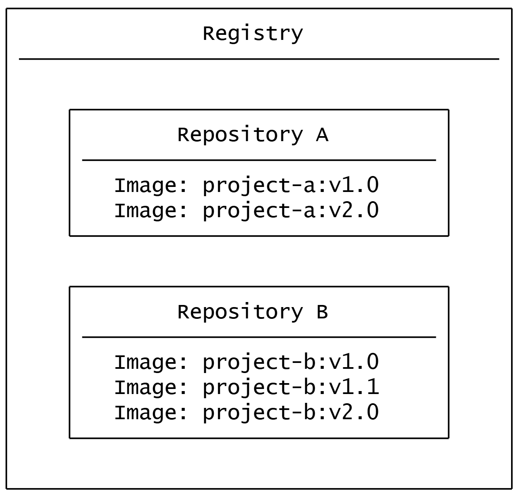

## 一、Docker Desktop 和 Shell 命令行里的 `docker` 是什么关系？

**它们是同一个东西的两种操作方式，底层都是同一个 Docker 引擎。**

- 你在 CMD/PowerShell 里敲 `docker run`、`docker ps` 这些命令，和在 Docker Desktop 里点按钮，本质上是在给同一个 Docker 引擎发指令。
- Docker Desktop 启动后，会在后台运行 Docker 引擎服务，你的命令行工具（CMD/PowerShell）会自动连接到这个引擎，所以两边操作的容器、镜像都是同步的。

## 二、两者的作用分工

|        工具        |       角色       |         核心作用         |
| :----------------: | :--------------: | :----------------------: |
| **Docker Desktop** | 图形界面管理工具 |  可视化管理、配置和监控  |
|  **Shell 命令行**  |   命令行客户端   | 直接执行指令、自动化操作 |

## 三、Docker Desktop 桌面图形工具的核心作用（给你挑最实用的讲）

### 1. 可视化查看容器状态

不用敲 `docker ps`，打开就能看到：

- 哪些容器在运行、哪些停止了
- 容器占用的 CPU / 内存 / 磁盘资源
- 端口映射、日志、容器 ID 等信息

### 2. 一键启停 / 删除容器

不用敲 `docker start/stop/rm`，点一下按钮就能：

- 启动 / 停止 / 重启容器
- 删除容器和镜像
- 直接打开容器的终端（`docker exec -it` 的可视化版本）

### 3. 实时查看容器日志

不用敲 `docker logs`，点进容器的 `Logs` 标签，就能看到实时日志，还能搜索过滤，排查问题特别方便。


### 4. 图形化配置镜像源 / 资源限制

- 设置国内镜像加速源（解决拉取慢的问题）
- 给 Docker 分配 CPU、内存、磁盘空间限制
- 开启 / 关闭 Kubernetes、WSL 集成等高级功能

### 5. 管理镜像和卷

- 查看所有本地镜像，一键清理无用镜像
- 管理数据卷（Volumes），不用敲 `docker volume` 命令

### 6. 一键访问容器服务

比如你跑了 Nginx，直接点端口旁边的箭头，就能在浏览器里打开 `http://localhost:9090`，不用手动输地址。

## 四、什么时候用哪个？


|              场景              |    推荐工具    |          原因          |
| :----------------------------: | :------------: | :--------------------: |
| 快速看状态、查日志、点一下启停 | Docker Desktop |    直观、不用记命令    |
|  写脚本、自动化部署、批量操作  |  Shell 命令行  | 可复制、可集成到脚本里 |
|    调试容器问题、看实时日志    | Docker Desktop |   界面友好，过滤方便   |
|     一次性快速启动容器测试     |   两者都可以   |        看你习惯        |


💡 简单说：**命令行是给程序员写脚本、自动化用的，Docker Desktop 是给所有人看状态、点按钮管理用的，两者互补，不是二选一。**

## 实战案例: 启动一个nginx服务

   安装win桌面版的desk工具后，本地就存在了docker。

   第一步：  首先拉取nginx镜像


  第二步：  管理员身份打开命令行 ，执行以下命令。

```
docker run -d -p 9090:80 -v D:\web:/usr/share/nginx/html nginx:latest

docker启动一个nginx项目。 暴露9090前端服务，映射容器80服务。并挂载D盘\web 到容器的/usr/share/nginx/html，使用nginx最新版。
```

  第三步： 浏览器中可以访问9090端口了，此时打开desk，可以看到当前docker启动的容器。


点击容器Name可以进入这个容器内部，也可以编辑html下的文件，编辑后，保存。刷新页面即可。

此时查看宿主机上的D:\web\index.html文件，可以看到修改后的内容，并且修改index文件后，保存刷新，也可以看到最新内容。  

双向绑定！


### 关键判断依据

1. **挂载标记**：`/usr/share/nginx/html/index.html` 旁边有蓝色的 `MOUNT` 标识，说明宿主机文件和容器文件已经绑定。

2. 双向同步逻辑

   - 你在 Docker Desktop 的 `Files` 标签里修改 `index.html`，保存后，宿主机 `D:\web\index.html` 文件会同步更新。
   - 反过来，你直接在宿主机修改 `D:\web\index.html`，保存后，容器里的文件也会同步更新，刷新页面就能看到最新内容。

   

3. **端口和容器状态**：容器 `sleepy_elbakyan` 正在运行，端口 `9090:80` 映射正常，说明 Nginx 服务能正常读取绑定的文件。


## 名词解释

### [注册表与仓库](https://docker.it-docs.cn/get-started/docker-concepts_the-basics_what-is-a-registry#registry-vs-repository)




在 Docker 语境里，**“注册表” 就是 Registry 的中文翻译，两者指的是同一个东西。**
**补充说明**
英文 Registry，直译就是 “注册表 / 登记处”，在容器领域统一译为 镜像仓库服务，比如 Docker Hub、阿里云镜像服务都是典型的 Registry。
它和 Windows 系统里的 “注册表（Registry）” 是完全不同的概念，Docker 里说的 Registry 只和容器镜像相关。
用你图里的结构来理解

Registry（镜像仓库服务）= 整个 “镜像仓库平台”
里面包含多个 Repository（项目仓库，比如 project-a、project-b）
每个 Repository 下再存放不同版本的 Image（镜像，比如 project-a:v1.0、project-a:v2.0）

## 镜像监控网站

https://status.anye.xyz/

哪些镜像能用一览无余


